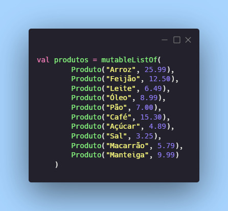

# Dia 17 - Ordenação: Organizando a Bagunça

## DESAFIO: Ordenando Produtos por Preço

**Descrição**: Imagine que nós temos uma lista de produtos de um mercado em um array onde temos o nome e o preço de venda. Ou seja, nós teremos um array dentro de outro array. Como no código abaixo:



O desafio será criar a função de ordenação desse array.

```kt
data class Produto(val nome: String, val preco: Double)

// Lista ordenada por nome
fun ordenarPorNome(lista: MutableList<Produto>): List<Produto>{
    val n = lista.size

    for (i in 0 until n - 1) {
        var minIndex = i
        for (j in i + 1 until n) {
            if (lista[j].nome < lista[minIndex].nome) {
                minIndex = j
            }
        }
        if (minIndex != i) {
            val temp = lista[i]
            lista[i] = lista[minIndex]
            lista[minIndex] = temp
        }
    }
    return lista
}

// Lista ordenada por preço
fun ordenarPorPreco(lista: MutableList<Produto>): List<Produto> {
    val n = lista.size

    for (i in 0 until n - 1) {
        var minIndex = i
        for (j in i + 1 until n) {
            if (lista[j].preco < lista[minIndex].preco) {
                minIndex = j
            }
        }
        if (minIndex != i) {
            val temp = lista[i]
            lista[i] = lista[minIndex]
            lista[minIndex] = temp
        }
    }
    return lista
}

fun main() {
    val produtos = mutableListOf(
        Produto("Arroz", 25.99),
        Produto("Feijão", 12.50),
        Produto("Leite", 6.49),
        Produto("Óleo", 8.99),
        Produto("Pão", 7.00),
        Produto("Café", 15.30),
        Produto("Açúcar", 4.89),
        Produto("Sal", 3.25),
        Produto("Macarrão", 5.79),
        Produto("Manteiga", 9.99)
    )

    // Mostra a lista original de produtos
    println("==================================")
    println("Lista Original:")
    println("==================================")
    produtos.forEach { println(it) }

    // Mostra a lista de produtos ordenados por nome
    println("==================================")
    println("Produtos Ordenados por Nome:")
    println("==================================")
    ordenarPorNome(produtos.toMutableList()).forEach { println(it) }

    // Mostra a lista de produtos ordenados por preço
    println("==================================")
    println("Produtos Ordenados por Preço:")
    println("==================================")
    ordenarPorPreco(produtos.toMutableList()).forEach { println(it) }
}
```

